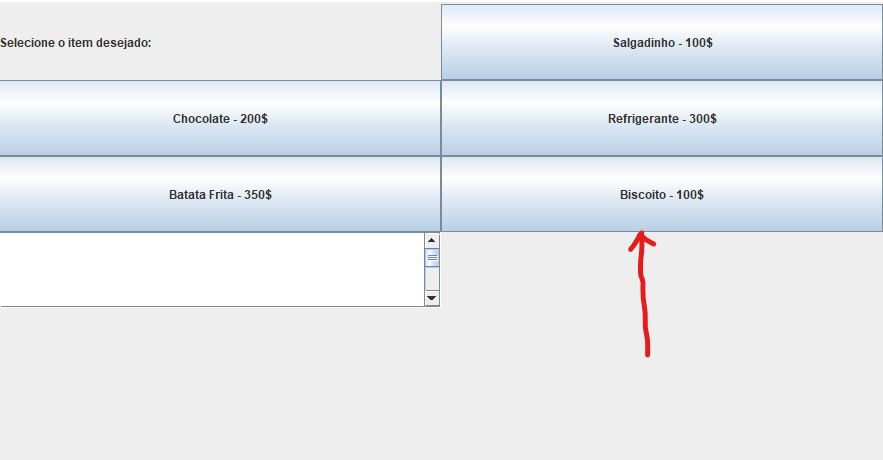
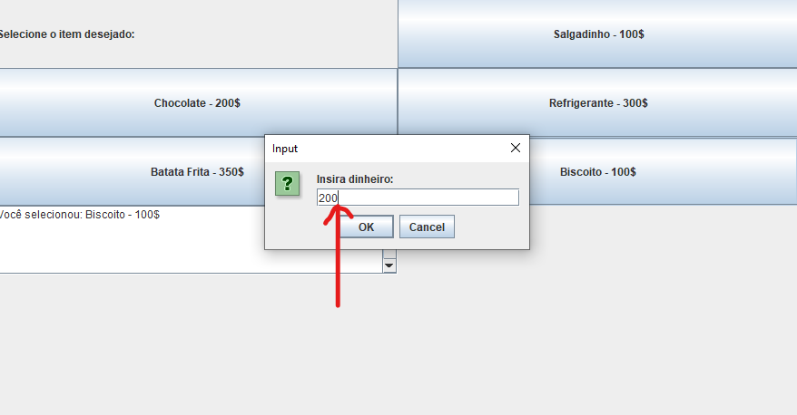
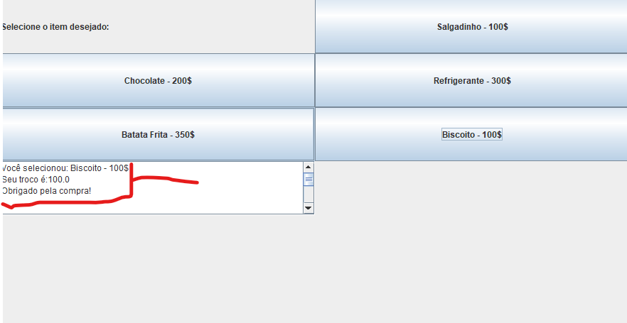

# Maquina de compra #

Inicie meus estudos em JAVA  a um tempinho e venho praticando e fazendo alguns programinhas bem basicos so para não ficar parado e claro aprendendo.
Então resolvi fazer esse programa que simula uma maquina de compra com funcionalidades parecidas,
esse programa é bem basico mas para mim como iniciante foi bem complexo, espero que gostem


# Requerimentos #
- [ ] JDK +8
- [ ] git 

# rodar #
```
git clone https://github.com/DsK-David/maquinadecomprajava.git
```

```
cd maquinadecomprajava
java MaquinaDeComidaGUI.java
```

# passos #
selecionar produto:


Colocar o dinheiro valor:


Receber o produto e o troco se ouver troco:

